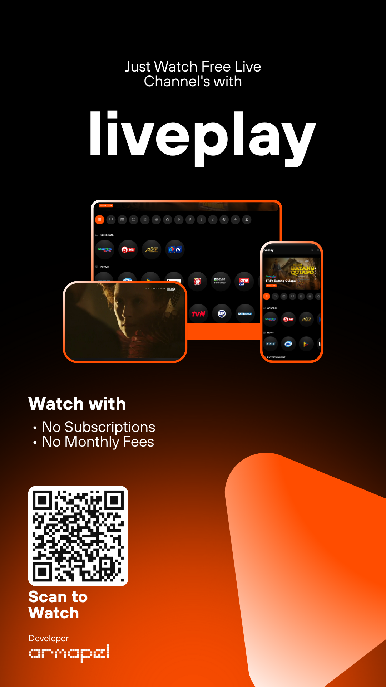
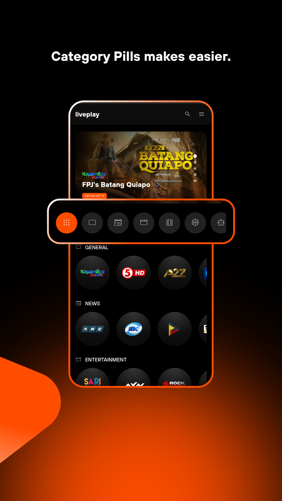
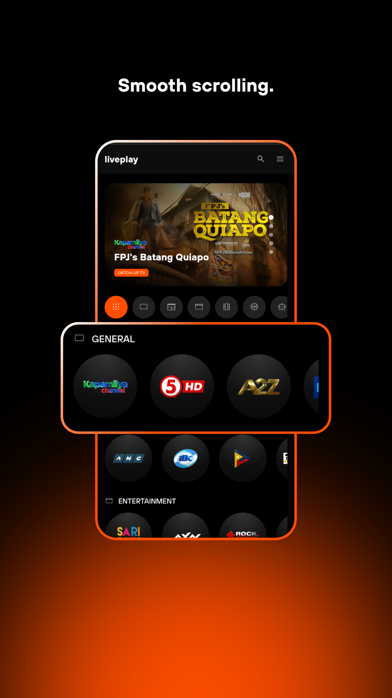
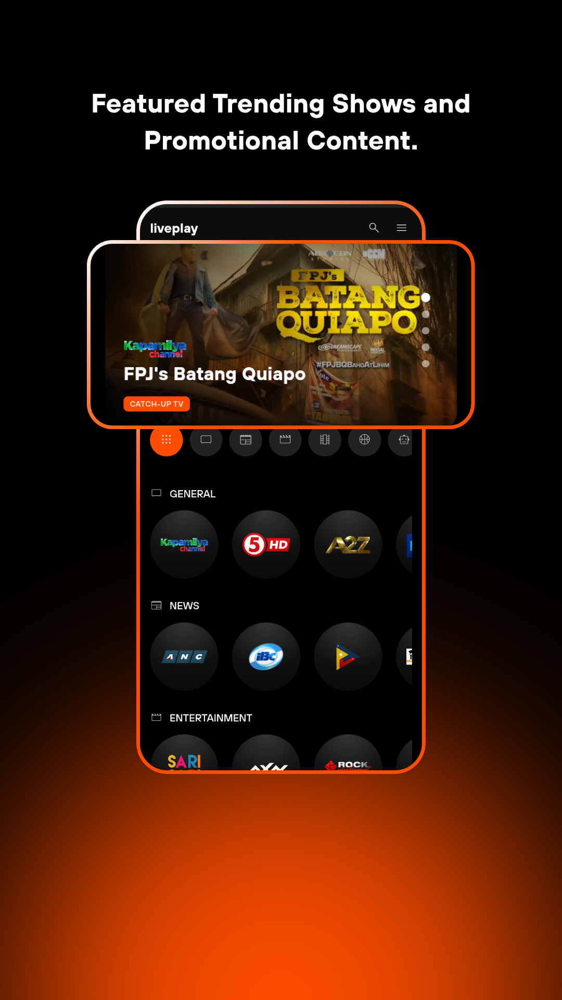
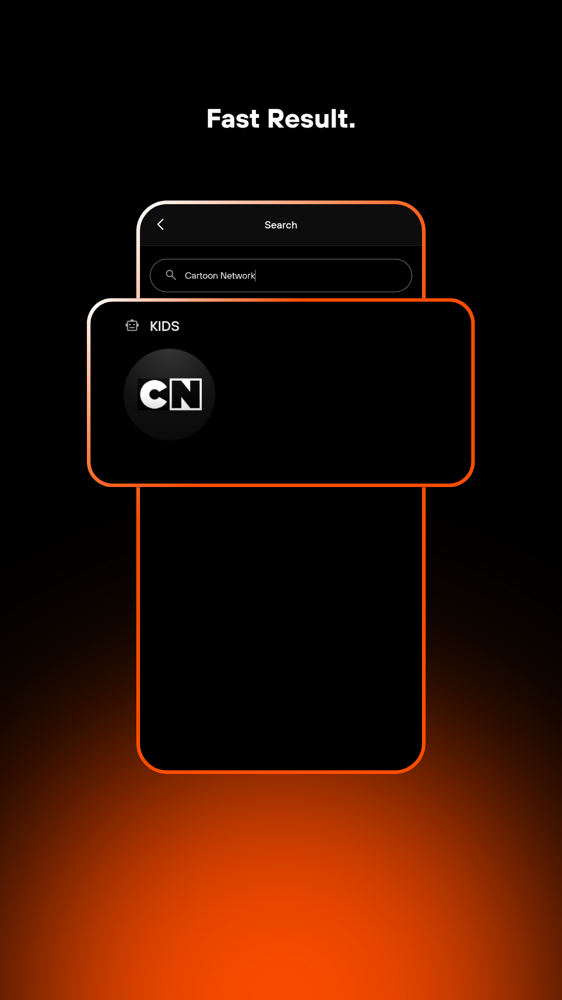
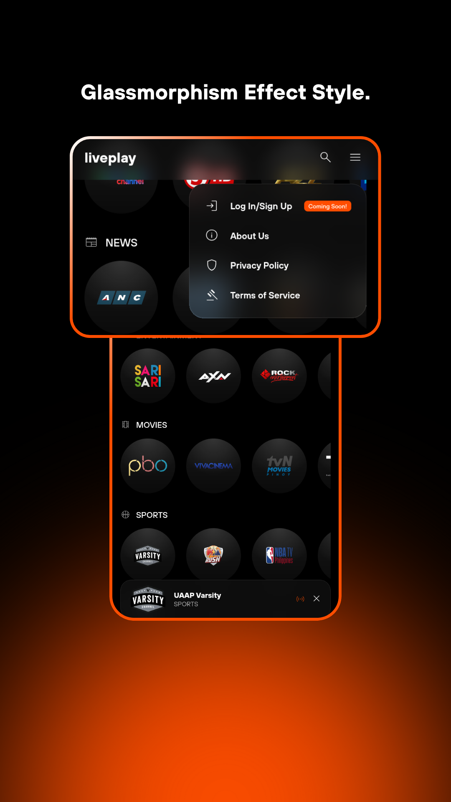
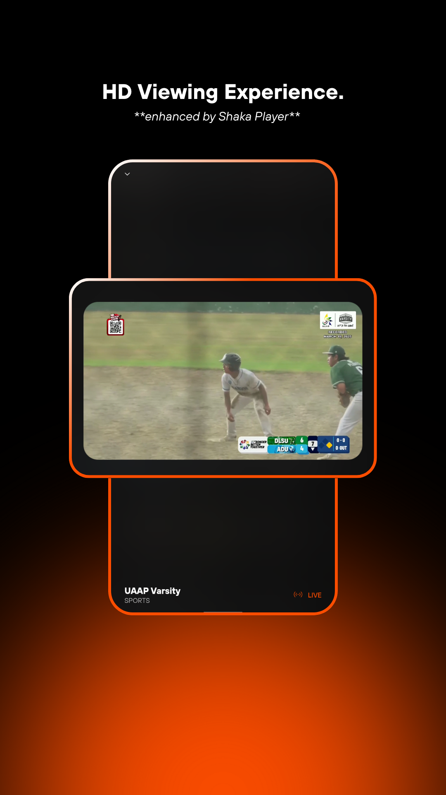
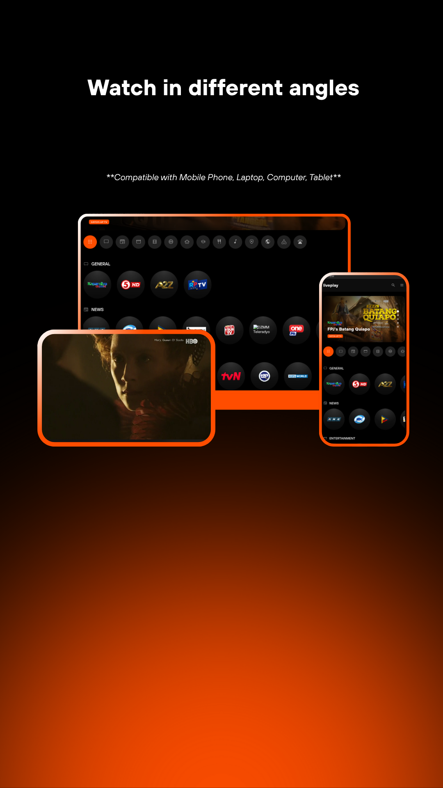

  

  <strong>Just Watch Free Live Channels with liveplay.</strong>

  A modern, user-friendly web application designed for a seamless viewing experience, offering free access to a curated list of live TV channels with no subscriptions or monthly fees.

<h2>Features</h2>
  
  
  
  
  
  
  
  
  
  

---

<h2>Features</h2>

*   **💎 Glassmorphism UI:** A beautiful, modern interface with blurred, glass-like elements for a premium feel.
*   **✨ HD Viewing Experience:** Enhanced by Shaka Player for crisp, high-definition streaming.
*   **🚀 Smooth & Fast:** Experience smooth scrolling through channel lists and fast search results.
*   **📺 Featured Content:** A dynamic slider at the top highlights trending shows and promotional content.
*   **👆 Easy Category Filtering:** Icon-based category pills make finding what you want to watch easier than ever.
*   **📱 Multi-Device Ready:** Fully compatible with mobile phones, laptops, computers, and tablets for watching in different angles.

<h1>Tech Stack</h1>

*   **HTML5 & CSS3:** For a clean, modern, and responsive structure.
*   **Vanilla JavaScript:** For dynamic content rendering and interactivity.
*   **Shaka Player:** An open-source DASH and HLS player from Google for robust video playback and DRM.

---

<h1>Developer</h1>

 
  

